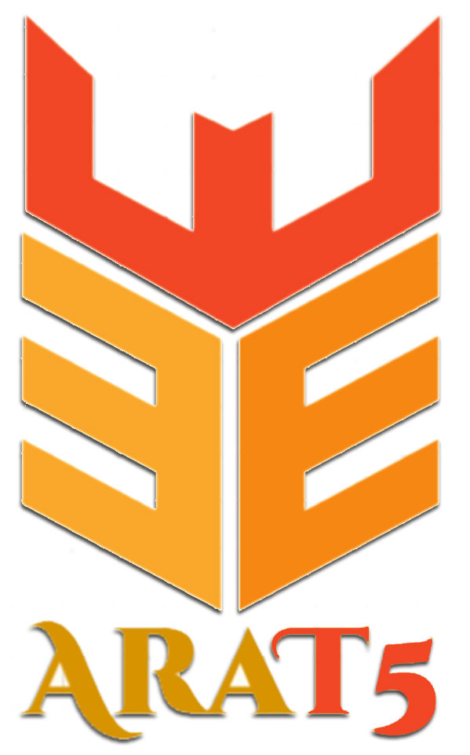

# AraT5: Text-to-Text Transformers for Arabic Language Understanding and Generation



This is the repository accompanying our paper [AraT5: Text-to-Text Transformers for Arabic Language Understanding and Generation](link). In this is the repository we introduce:
* Introduce **AraT5<sub>MSA</sub>**, **AraT5<sub>Tweet</sub>**, and **AraT5**: three powerful Arabic-specific text-to-text Transformer based models;
* Introduce **ARGNE**:  A new benchmark for Arabic language generation and evaluation for four Arabic NLP tasks, namely, ```machine  translation```,  ```summarization```,  ```newstitle   generation```   and   ```question   generation```;
* evaluate  ```AraT5``` models on ```ARGNE``` and compare against available language models.

Our models establish new state-of-the-art (SOTA) on  several publicly available datasets.
Our language models are publicaly available for research (see below).

The rest of this repository provides more information about our new language models, benchmark, and experiments.

---

## Table of Contents
- [1 Our Language Models](#1-Our-Language-Models)
  - [1.1 Training Data](#11-training-data)
  - [1.2 Models Architecture](#12-models-architecture)
  - [1.3 AraT5 Models](#13-arat5-models)
- [2. Our Benchmark: ARGNE](#2-our-benchmark-ARGNE)
  - [2.1 Machine Translation](#21-machine-translation)
  - [2.2 Text Summarization](#22-text-summarization)
  - [2.3 News Title Generation](#23-news-title-generation)
  - [2.4 Question Generation](#24-question-generation)
- [3. AraT5 Evaluation](#3-model-evaluation)
  - [3.1 Machine Translation](#31-machine-translation)
  - [3.2 Text Summarization](#32-text-summarization)
  - [3.3 News Titl and Question Generation](#33-news-question-generation)
- [4. How to use AraT5 model](#4-how-to-use-arat5-model)
- [5. Ethics](#5-ethics)
- [6. AraT5 Models Checkpoints](#6-arat5-models-checkpoints)
- [7. Citation](#7-citation)
- [8. Acknowledgments](#8-acknowledgments)

## 1. Our Language Models


## 1.1 Training Data

* **MSA Training Data**: We use 70GB of MSA text 7.1B tokens) from the following sources: [AraNews](nagoudi2020machine), [El-Khair](elkhair-2016), [Gigaword](https://catalog.ldc.upenn.edu/LDC2009T30), [OSCAR](suarez2019asynchronous), [OSIAN](zeroual2019osian),  Wikipedia Arabic, and [Hindawi Books](https://www.hindawi.org/books/}{https://www.hindawi.org/books).

* **Twitter Training Data**: We randomly sample 1.5B Arabic tweets from a large in-house dataset of about 10B tweets. We use string matching to only include tweets with at least 3 Arabic words, regardless whether the tweet has non-Arabic string or not.  %That is, we do not remove non-Arabic so long as the tweet meets the $3$ Arabic word criterion. 
The dataset makes up 178GB of text 21B tokens. 


## 1.2 Models Architecture

To train our AraT5, we use the same architecture as ```T5-base``` and  ```T5-small``` [(Raffel 2019)](https://arxiv.org/abs/1910.10683) where both  encoder and decoder  has 12 layers each with 12 attention heads, and 768 hidden units.


## 1.3 AraT5 Models


We pre-train three powerful variants of the text-to-text transformer (T5) model dedicated to Modern Standard Arabic (MSA) and Arabic dialects, AraT5. AraT5 comes. AraT5 comes in three flavors:  
*  **AraT5<sub>MSA</sub>**:  trained on MSA data exclusively
*  **AraT5<sub>Tweet</sub>**: trained on Twitter data (mix of MSA and dialectal Arabic), 
*  **AraT5**:  trained on both Twitter and MSA data.


## 2. ARGNE Benchmark and AraT5 Evaluation
To  evaluate  our  models, we  also introduce  **ARGNE**,   a new benchmark for   A new benchmark for Arabic language generation and evaluation.   ARGNE is composed of four tasks, namely, ```machine  translation```,  ```summarization```,  ```newstitle   generation```   and   ```question   generation```. ARGNE  is  collected  from  a  total  of  ten datasets, including two new large datasets pro-posed in this work.


# 3. AraT5 Evaluation


### 3.1 Machine Translation

|**Reference**| **Data  (#classes)**     | **TRAIN**   | **DEV**    | **TEST**   |
|---------|--------|--------|-------|------|
|[Alomari et al. (2017)](https://www.researchgate.net/publication/317501447_Arabic_Tweets_Sentimental_Analysis_Using_Machine_Learning)|AJGT (2)      |   1.4K | -      |    361 | 
|[Abdul-Mageed et al. (2020b)](https://www.aclweb.org/anthology/2020.osact-1.3) |AraNET<sub>Sent</sub> (2)      | 100K | 14.3K | 11.8K |
|[Al-Twairesh et al. (2017)](https://www.aclweb.org/anthology/P16-1066)|AraSenTi (3)          |  11,117 |  1,407 |  1,382 | 
|[Abu Farha and Magdy (2017)](https://www.aclweb.org/anthology/2020.osact-1.5)|ArSarcasm<sub>Sent</sub> (3)   |   8.4K | -      |  2.K | 
|[Elmadany et al. (2018)](https://www.semanticscholar.org/paper/ArSAS-%3A-An-Arabic-Speech-Act-and-Sentiment-Corpus-Elmadany-Mubarak/d32d3bb226f1738f72c415c6b03b5ad66ff604a4)|ArSAS (3)                           |  24.7K | -      |  3.6K | 

### 3.2 Text Summarization

| **Dataset**  |  **Metric** | **mT5** | **AraT5<sub>Tweet</sub>** | **AraT5<sub>MSA</sub>** | **MSA** | 
|----------------|:------:|:----------:|:-----------:|:-------:|:------:|
|   | Rouge1 | 62.98 | 60.74  | 59.54 | 54.61 |   
| EASC  | Rouge2 | 51.93 | 48.89 | 47.37 | 43.58 |   
|   | RougeL | 62.98 | 60.73 | 59.55 | 54.55 |      
| | Rouge1 |  71.63 | 74.61 | 72.64 |  73.48 |   
| WikiLin| Rouge2 | 63.60 |  67.00  | 64.21| 65.09 |  
| | RougeL | 71.56 | 74.52| 72.57 | 73.37|     


### 3.3 News Titl and Question Generation

| **Dataset**  |  **Metric** | **mT5** | **AraT5<sub>Tweet</sub>** | **AraT5<sub>MSA</sub>** | **MSA** | 
|----------------|:------:|:----------:|:-----------:|:-------:|:------:|
|  ARGEN<sub>MT</sub> | BLEU | 19:49 20:00 20:61 20:51   
| ARGEN<sub>QG</sub>  | BLEU | 51.93 | 48.89 | 47.37 | 43.58 |   


#  4. How to use AraT5 model

**AraT5** Fine-Tuning demo with PyTorch checkpoint for  News Title Generation on the Aranews dataset [](https://colab.research.google.com/drive/1GFOGolWPIfDvYdSNdGFrOXwu3Gu28k2b?usp=sharing)

## 5. Ethics

Our models are developed using data from the public domain. 
We provide access to our models to accelerate scientific research with no liability on our part.
Please use our models and benchmark only ethically.
This includes, for example, respect and protection of people's privacy.
We encourage all researchers who decide to use our models to adhere to the highest standards.
For example, if you apply our models on Twitter data, we encourage you to review Twitter policy at [Twitter policy](https://developer.twitter.com/en/developer-terms/agreement-and-policy). For example, Twitter provides the following policy around use of [sensitive information](https://developer.twitter.com/en/developer-terms/more-on-restricted-use-cases): 

### Sensitive information

You should be careful about using Twitter data to derive or infer potentially sensitive characteristics about Twitter users. Never derive or infer, or store derived or inferred, information about a Twitter user’s:

- Health (including pregnancy)
- Negative financial status or condition
- Political affiliation or beliefs
- Racial or ethnic origin
- Religious or philosophical affiliation or beliefs
- Sex life or sexual orientation
- Trade union membership
- Alleged or actual commission of a crime
- Aggregate analysis of Twitter content that does not store any personal data (for example, user IDs, usernames, and other identifiers) is permitted, provided that the analysis also complies with applicable laws and all parts of the Developer Agreement and Policy.

---
# 6.  AraT5 Models Checkpoints 

AraT5 Pytorch and Tenserflow checkpoints are available on Huggingface website for direct download and use ```exclusively for research```. `For commercial use, please contact the authors via email @ (*muhammad.mageed[at]ubc[dot]ca*).`

| **Model**   | **Link** | 
|---------|:------------------:|
| **AraT5-msa-base**  |     [https://huggingface.co/UBC-NLP/AraT5-base](https://huggingface.co/UBC-NLP/AraT5-msa-base)     |     
| **AraT5-tweet-base**  |   [https://huggingface.co/UBC-NLP/AraT5-msa-base](https://huggingface.co/UBC-NLP/AraT5-msa-base)    |      
|  **AraT5-msa-base** |     [https://huggingface.co/UBC-NLP/AraT5-tweet-base](https://huggingface.co/UBC-NLP/AraT5-base)       |  
| **AraT5-msa-small** |     [https://huggingface.co/UBC-NLP/AraT5-msa-base](https://huggingface.co/UBC-NLP/AraT5-tweet-base)   |     
| **AraT5-tweet-small**|    [https://huggingface.co/UBC-NLP/AraT5-tweet-base](https://huggingface.co/UBC-NLP/AraT5-tweet-base) |  

## 7. Citation
If you use our AraT5 models for your scientific publication, or if you find the resources in this repository useful, please cite our paper as follows (to be updated):
```
@inproceedings{araT5-2021,
    title = "{AraT5: Text-to-Text Transformers for Arabic Language Understanding and Generation",
    author = "Nagoudi, El Moatez Billah  and
      Elmadany, AbdelRahim  and
      Abdul-Mageed, Muhammad",
    booktitle = "https://arxiv.org/pdf/xxx.xxxxx",
    month = aug,
    year = "2021"}

```

---

## 8. Acknowledgments
We gratefully acknowledge support from the Natural Sciences and Engineering Research Council  of Canada, the  Social  Sciences and  Humanities  Research  Council  of  Canada, Canadian  Foundation  for  Innovation,  [ComputeCanada](www.computecanada.ca) and [UBC ARC-Sockeye](https://doi.org/10.14288/SOCKEYE). We  also  thank  the  [Google TensorFlow Research Cloud (TFRC)](https://www.tensorflow.org/tfrc) program for providing us with free TPU access.
